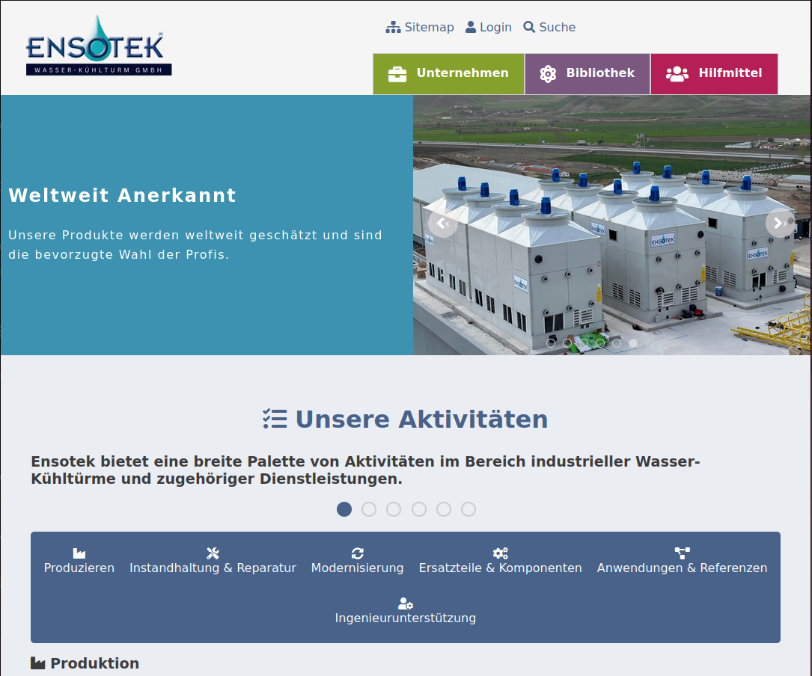

---

# Kuhlturm Ensotek Web Projekt

Dies ist ein Webprojekt für Kuhlturm-Ensotek GmbH, welches eine interaktive Website bereitstellt, um Informationen über die Aktivitäten, Produkte, das Team und mehr des Unternehmens darzustellen. Das Projekt verwendet HTML, CSS, JavaScript (mit Komponenten für modulare Struktur) und jQuery für zusätzliche Funktionalitäten.



## Demo

Die Website ist auf GitHub Pages veröffentlicht und kann über diesen [Link angesehen werden](https://orhanguezel.github.io/Ensotek/).

## Projektstruktur

```
kuhlturm-ensotek/
│
├── assets/
│   └── img/             # Bildressourcen, die auf der gesamten Website verwendet werden
│
├── components/          # JavaScript-Module für einzelne Komponenten
│   ├── aktivit.js       # Aktivitäten-Bereich Komponente
│   ├── angebot.js       # Angebot-Komponente
│   ├── carousel.js      # Carousel-Bereich Komponente
│   ├── footer.js        # Footer-Bereich Komponente
│   ├── galerie.js       # Galerie-Bereich Komponente
│   ├── geschichte.js    # Geschichte-Bereich Komponente
│   ├── header.js        # Header (Navigation) Komponente
│   ├── kontakt.js       # Kontakt-Bereich Komponente
│   ├── mainContent.js   # Hauptinhalt-Layout Komponente
│   ├── news.js          # News-Bereich Komponente
│   ├── referans.js      # Referenzen-Bereich Komponente
│   ├── team.js          # Team-Bereich Komponente
│   ├── uberUns.js       # Über Uns-Bereich Komponente
│   ├── vision.js        # Vision-Bereich Komponente
│   └── zertifikate.js   # Zertifikate-Bereich Komponente
│
├── css/                 # CSS-Dateien für die Gestaltung einzelner Komponenten
│   ├── aktivit.css      # Styling für den Aktivitäten-Bereich
│   ├── carousel.css     # Styling für das Carousel
│   ├── components.css   # Allgemeine Komponent-Stile
│   ├── layout.css       # Allgemeines Layout und responsives Design
│   ├── root.css         # Globale CSS-Variablen und Basisstile
│   └── weitere CSS-Dateien für verschiedene Abschnitte ...
│
├── data/                # Daten-Dateien für dynamische Inhalte
│   ├── articles-data.js # Artikeldaten
│   ├── galerie-data.js  # Galeriedaten
│   └── weitere Daten-Dateien für verschiedene Abschnitte ...
│
├── js/
│   └── app.js           # Haupt-JavaScript-Einstiegspunkt für das Projekt
│
├── index.html           # Haupt-HTML-Datei für die Website
├── artikel.html         # HTML-Datei für die Artikel-Seite
├── contact.php          # PHP-Datei für Formularübermittlungen
├── materialien.html     # HTML-Datei für die Materialien-Seite
├── produkte.html        # HTML-Datei für die Produkte-Seite
├── README.md            # Projektdokumentation
├── LICENSE              # Lizenzdatei
├── package.json         # Projektabhängigkeiten
└── package-lock.json    # Abhängigkeits-Lockfile
```

## Einstieg

### Voraussetzungen

- Node.js und npm installiert
- Grundkenntnisse in HTML, CSS und JavaScript

### Installation

1. Repository klonen:

   ```bash
   git clone https://github.com/Orhanguezel/Ensotek.git
   ```

2. In das Projektverzeichnis wechseln:

   ```bash
   cd kuhlturm-ensotek
   ```

3. Abhängigkeiten installieren:

   ```bash
   npm install
   ```

### Projekt lokal starten

1. Die Dateien lokal mit einem Entwicklungsserver wie der `Live Server`-Erweiterung für VS Code oder mit npm-Paketen wie `http-server` servieren:

   ```bash
   npm install -g http-server
   http-server .
   ```

2. Besuche `http://localhost:8080` (oder den vom Server angegebenen Port), um die Website lokal zu betrachten.

## Projektübersicht

- **Komponenten**: Alle Inhalte sind in einzelne Komponenten (im `components/` Ordner) modularisiert. Diese Komponenten werden dynamisch mittels JavaScript geladen.
  
- **CSS**: Jeder Abschnitt der Seite hat seine eigene CSS-Datei für eine einfachere Wartung und Modularität.

- **PHP (Kontaktformular)**: Die Formularübermittlung wird über die Datei `contact.php` im Stammverzeichnis abgewickelt.

## Funktionen

1. **Header und Navigation**: In `header.js` implementiert, erstellt diese Komponente die Seitennavigation und den Logo-Bereich.
   
2. **Carousel**: Das Haupt-Slider-Carousel ist in `carousel.js` implementiert und verwendet benutzerdefiniertes JavaScript.
   
3. **Kontaktformular**: Die Formularfunktionalität wird in `contact.php` verwaltet und mit `kontakt.css` gestaltet.
   
4. **Galerie**: Galerie-Bilder können in `galerie.js` hinzugefügt und verwaltet werden, und `galerie.css` sorgt für das Styling.

## Entwicklung

Änderungen können an den einzelnen Komponenten-Dateien und CSS-Dateien vorgenommen werden. Nach dem Speichern die lokale Seite aktualisieren, um die Änderungen zu sehen.

### Hinzufügen neuer Komponenten

1. Erstelle eine neue Komponente im Ordner `components/`.
2. Füge entsprechenden HTML-, CSS- und JavaScript-Code hinzu.
3. Importiere und nutze die neue Komponente in `index.html` oder anderen HTML-Dateien.

## Beitrag leisten

1. Repository forken.
2. Einen neuen Branch für das Feature oder den Bugfix erstellen.
3. Änderungen committen.
4. Den Branch pushen und eine Pull-Request öffnen.

## Lizenz

Dieses Projekt ist unter der MIT-Lizenz lizenziert.

--- 