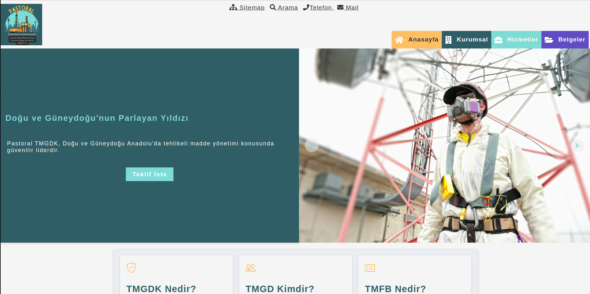

# Pastoral TMGDK - Tehlikeli Madde Güvenlik Danışmanlık Kuruluşu

## Hakkında
Pastoral TMGDK, tehlikeli madde güvenlik danışmanlığı alanında profesyonel hizmetler sunarak sektör liderliğine oynamaktadır. Bu proje, kuruluşun web tabanlı uygulamalarını kapsamakta olup; tehlikeli madde yönetimi, mevzuat bilgilendirmeleri, çevre ve insan sağlığı odaklı danışmanlık çözümleri sunmayı hedeflemektedir.

**Canlı Demo:** [Pastoral TMGDK](https://www.pastoraltmgdk.com)



---

## Proje Dizini

Proje dizini şu şekildedir:

```
/home/orhan/Dokumente/Pastoral-TMGD
|
|-- assets
|   |-- img
|       |-- genel
|       |-- icon
|       |-- section
|       |-- slayt
|       |-- favicon.png
|       |-- logo.png
|
|-- components
|   |-- basvuruForm.js
|   |-- carousel.js
|   |-- content.js
|   |-- footer.js
|   |-- header.js
|   |-- hizmetlerimiz.js
|   |-- mevzuat.js
|   |-- sss.js
|   |-- teklifForm.js
|   |-- vision.js
|
|-- css
|   |-- root.css
|   |-- layout.css
|   |-- header.css
|   |-- footer.css
|   |-- content.css
|   |-- quality.css
|   |-- sitemap.css
|
|-- data
|   |-- mevzuat-data.js
|   |-- sektorler-data.js
|   |-- services-data.js
|
|-- js
|   |-- app.js
|
|-- index.html
|-- hizmetlerimiz.html
|-- mevzuat.html
|-- sektorler.html
|-- arama.html
|-- basvuru.html
|-- teklif.html
|-- robots.txt
|-- README.md
```

---

## Projede Kullanılan Özellikler
- **Dinamik Komponentler:** Header, footer, carousel gibi sayfa bileşenleri.
- **Dinamik Veri Yükleme:** Hizmetler, mevzuatlar ve sektörler veri tabanından dinamik olarak yüklenir.
- **Responsive Tasarım:** Mobil cihazlara uyumlu tasarım.
- **SEO Uyumluluğu:** Robots.txt ve sitemap ile arama motoru optimizasyonu.

---

## Nasıl Çalışır

### 1. Yerel Ortamda Çalıştırma
1. Proje dizinine gidin.
   ```bash
   cd /home/orhan/Dokumente/Pastoral-TMGD
   ```
2. Node.js bağlımlılıklarını yükleyin.
   ```bash
   npm install
   ```
3. Projeyi başlatın.
   ```bash
   npm start
   ```
4. Tarayıcınızda projeyi açın: `http://localhost:3005`

### 2. Uygulama Dağıtımı
1. Proje dosyalarını bir sunucuya yükleyin.
2. `.env` dosyasında uygun ayarları yapın.
3. Sunucuyu yeniden başlatın.

---

## Bileşenlerin Listesi

### Header (header.js)
- **Dosya Yolu:** `components/header.js`
- **Açıklama:** Tüm sayfalarda dinamik olarak yüklenir.

### Footer (footer.js)
- **Dosya Yolu:** `components/footer.js`
- **Açıklama:** Sayfa alt bilgisi.

### Vision (vision.js)
- **Dosya Yolu:** `components/vision.js`
- **Açıklama:** Misyon ve vizyon bilgilerini sunar.

### Mevzuat (mevzuat.js)
- **Dosya Yolu:** `components/mevzuat.js`
- **Açıklama:** Yasal mevzuatları dinamik olarak listeler.

### Carousel (carousel.js)
- **Dosya Yolu:** `components/carousel.js`
- **Açıklama:** Ana sayfa slaytları.

---

## Katkıda Bulunma
1. **Fork:** Bu repoyu forkladın.
2. **Çekme Talebi (Pull Request):** Yeni özellik veya düzeltmelerle katkıda bulunun.
3. **Issue:** Sorunları bildirin.


